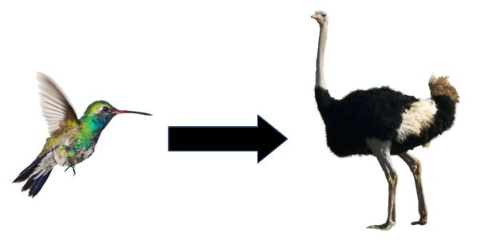

```{=html}
<style>

.navbar {
  background-color: #00A064;
  border-color: #ffffff;
}

.navbar-brand {
color:white!important;
}

.navbar-inverse .navbar-nav > .active > a, .navbar-inverse .navbar-nav > .active > a:hover, .navbar-inverse .navbar-nav > .active > a:focus {
    color: white;
    background-color: #97989A;
    font-weight: bold;
}
.fa {
color: white;
}

.navbar-inverse .navbar-nav > li > a {
color: white;
}

.navbar-inverse .navbar-nav > li > a:hover {
color: white;
}
</style>
```
```{r setup, include=FALSE}
library(flexdashboard)
library(phytools)
library(readxl)
require(rgdal)
library(rgeos)
library(sf)
library(RColorBrewer)
library(ggplot2)
library(dplyr)
library(ggExtra)
library(grid)
library(gridExtra)
library(tidyverse)
library(extrafont)
library(plotly)
library(ggridges)
library(showtext)
```
```{r read_data, include = FALSE}
# Traits par espèce BirdLife
SPECIES <- read_xlsx("data/AVONET Supplementary dataset 1.xlsx", sheet = 2)
# Grille de Behrman
grid <- rgdal::readOGR("data/spatial/BehrmannMeterGrid_WGS84_land.shp")
# Polygones des pays du monde
countriesGeo <- rgdal::readOGR("data/spatial/all_countries.shp")
# Dictionnaire géographique Birdlife 
```
```{r read_data_7z, include = FALSE}
archive::archive_extract('data/spatial/AllSpeciesBirdLifeMaps2019.7z')
rangeData<-read.csv("AllSpeciesBirdLifeMaps2019.csv")
```
```{r pre_process, cache=TRUE}
# projection de Behrmann
P4S.Behr <- CRS("+proj=cea +lon_0=0 +lat_ts=30 +x_0=0 +y_0=0 +datum=WGS84 +ellps=WGS84 +units=m +no_defs")
gridB<-spTransform(grid,P4S.Behr)
countries <- spTransform(countriesGeo,P4S.Behr)
# simplification
countriesS <- gSimplify(countries, tol=10000,topologyPreserve=TRUE)
countriesS2 <- st_as_sf(countriesS)

# selection variables et nettoyage
species <- SPECIES %>% select(Species1, Primary.Lifestyle, Trophic.Niche, Mass) %>% 
  na.omit() %>% 
  mutate(Primary.Lifestyle = as.factor(Primary.Lifestyle), Trophic.Niche = as.factor(Trophic.Niche))


########################
###### CARTE 1 #########
########################

# On associe à chaque espèce répertoriée dans le dico géographique sa masse
rangeData1 <- rangeData %>% select(Species, WorldID) %>% 
  merge(y = species[, c("Species1", "Mass")], by.x = "Species", by.y = "Species1") %>% 
  na.omit()


# On récupère les valeurs médianes de la masse par pays (par ID)
med.C <- rangeData1 %>% group_by(WorldID) %>% 
  mutate(masse_med = median(Mass)) %>% 
  select(-Mass, -Species) %>% 
  distinct()

carte1 <- gridB
# on implémente dans l'objet shapefile 
carte1@data <- carte1@data %>% select(-count, -sum, -mean, -min, -max)
carte1@data <- left_join(carte1@data, med.C)

# On construit un gradient de couleurs
# Pour tenir compte de la densité et non pas de la somme d'individus (les masses allant de 22g à 111kg), on construit des groupes d'intervalles. On construit les 50 quantiles (0%, 2%, 4%, ...) et le groupe 1 correspond au premier quantile (un seul individu), le groupe 2 aux individus qui ne sont pas dans le groupe 1 mais dans le second quantile, le groupe 3 aux individus du troisième quantile mais pas dans le groupe 2, etc...

carte1@data <- carte1@data %>% 
  mutate(col = findInterval(masse_med, quantile(masse_med,probs=seq(0,1,0.02),na.rm=T), all.inside = TRUE)) %>% 
  distinct()

carte1.sf <- st_as_sf(carte1)

########################
###### CARTE 2 #########
########################

carte2 <- gridB

n_sp <- rangeData %>% 
  select(Species, WorldID) %>% 
  group_by(WorldID) %>%
  mutate(n.sp = n()) %>% 
  select(-Species) 

carte2@data <-carte2@data %>% 
  select(-count, -sum, -mean, -min, -max) 
carte2@data <-left_join(carte2@data,n_sp)

carte2@data <- carte2@data %>% 
  mutate(col = findInterval(n.sp, quantile(n.sp,probs=seq(0,1,0.02),na.rm=T), all.inside = TRUE)) %>% 
  distinct()

carte2.sf <- st_as_sf(carte2)

```
```{r colors_typo}
colors<-c(brewer.pal(9,"PuBu")[-1])
colors<-colorRampPalette(colors)(50)
loadfonts(device = "win")
font_add_google("Montserrat")
```
```{r map1_densite1}
p1 <- carte1.sf %>% rename(Masse = col) %>%  
  ggplot() +
  geom_sf(aes(fill = Masse, color = Masse)) +
  scale_colour_gradientn(colours = colors, name = "Groupe associé à la masse",
                         guide=guide_colourbar(title.position = "top", 
                                             direction = "horizontal",
                                             ticks = FALSE)) +
  scale_fill_gradientn(colours = colors) +
  guides(fill = FALSE, scale = "none") +
  theme_void() +
  labs(title = "Répartition géographique de la masse des espèces d'oiseaux", 
       subtitle = "selon les données de BirdLife")+
  theme(plot.title = element_text(hjust = 0.2, vjust=0, size = 15, family="Montserrat", face="bold"),
        plot.margin = unit(c(0,0,0,0), "cm"),
        plot.subtitle = element_text(hjust = 0.15, vjust=-0.4, family="Montserrat"),
        legend.position=c(0.18, 0.18), 
        legend.title = element_text(size=8, family="Montserrat", face="bold", vjust = 0.8),
        panel.background = element_rect(fill = "transparent",colour = NA),
        plot.background = element_rect(fill = "transparent",colour = NA),
        legend.background = element_rect(fill = "white", color = NA), 
        legend.key.height = unit(2.5, "mm")
  )

p2 <- carte1.sf %>% mutate(grp=as.factor(col)) %>% filter(grp == c("10","20", "30", "40", "43", "45", "47", "50")) %>% ggplot() +
  aes(x = masse_med,y=grp, fill=stat(x)) +
  geom_density_ridges_gradient()+
  scale_fill_gradientn(colours = colors, name = "", 
                       guide=guide_colourbar(title.position = "bottom", 
                                             direction = "horizontal",
                                             ticks = FALSE))+
  theme_ridges() +
  labs(title = "Densité des groupes associés à la masse (g)")+
  theme(plot.title = element_text(hjust = 0.2, vjust=0, size = 15, family="Montserrat", face="bold"),
        plot.margin = unit(c(0.5,0,0.5,0), "cm"),
        legend.position=c(0.02, -0.10),
        legend.title = element_text(size=10, family="Montserrat", face="bold", vjust = 0.8),
        panel.background = element_rect(fill = "white",colour = NA),
        plot.background = element_rect(fill = "white",colour = NA),
        legend.background = element_rect(fill = "white", color = NA), 
        legend.margin = margin(6, 6, 6, 6),
        legend.key.height = unit(5, "mm"), 
        legend.key.width =  unit(3, "cm"),
        axis.text.x = element_blank()
  )+
  ylab("Groupes")+
  xlab("")
```
```{r map2_densite2}
p3 <- ggplot(carte2.sf) +
  geom_sf(aes(geometry = geometry, fill = col, color = col)) +
  scale_colour_gradientn(colours = colors, name = "Richesse spécifique") +
  scale_fill_gradientn(colours = colors, name = "Richesse spécifique", 
                       guide=guide_colourbar(title.position = "top", 
                                             direction = "horizontal",
                                             ticks = FALSE)) +
  guides(color = FALSE, scale = "none") +
  theme_void() +
  labs(title = "Distribution de la richesse en espèces d'oiseaux", 
       subtitle = "selon les données de BirdLife")+
  theme(plot.title = element_text(hjust = 0.2, vjust=0, size = 15, family="Montserrat", face="bold"),
        plot.margin = unit(c(0,0,0,0), "cm"),
        plot.subtitle = element_text(hjust = 0.15, vjust=-0.4, family="Montserrat"),
        legend.position=c(0.18, 0.18), 
        legend.title = element_text(size=8, family="Montserrat", face="bold", vjust = 0.8),
        panel.background = element_rect(fill = "transparent",colour = NA),
        plot.background = element_rect(fill = "transparent",colour = NA),
        legend.background = element_rect(fill = "white", color = NA), 
        legend.key.height = unit(2.5, "mm")
  )

p4 <- carte2.sf %>% 
  ggplot() +
  aes(x = n.sp,y=..density.., fill=stat(x)) +
  geom_density_ridges_gradient(size=1)+
  scale_fill_gradientn(colours = colors, name = "",
                       guide=guide_colourbar(title.position = "bottom", 
                                             direction = "horizontal",
                                             ticks = FALSE))+
  theme_ridges() +
  labs(title = "Densité de la richesse en espèces")+
  theme(plot.title = element_text(hjust = 0.2, vjust=0, size = 15, family="Montserrat", face="bold"),
        plot.margin = unit(c(0.5,0,0.5,0), "cm"),
        legend.position=c(0.02, -0.10),
        legend.title = element_text(size=10, family="Montserrat", face="bold", vjust = 0.8),
        plot.background = element_rect(fill = "white", color = "#f5f5f2"), 
        panel.background = element_rect(fill = "white", color = NA),
        legend.background = element_rect(fill = "white", color = NA), 
        legend.margin = margin(6, 6, 6, 6),
        legend.key.height = unit(5, "mm"), 
        legend.key.width =  unit(3, "cm"),
        axis.text.x = element_blank()
  )+
  ylab("")+
  xlab("")
```
```{r couleurs}
aerien <- "#DCDAEB"
aquatique <- "#51abb0"
generaliste <- "#95c4aa"
insessorial <- "#285928"
terrestre <- "#664b2c"
```
```{r masse_richesse}
colors<-c(terrestre, generaliste, insessorial, aerien, aquatique)

species <- SPECIES %>% mutate(Species1 = as.factor(Species1), 
                              Family1 = as.factor(Family1), 
                              Order1 = as.factor(Order1), 
                              Lifestyle = as.factor(Primary.Lifestyle),
                              Generalist_specialist = fct_recode(Lifestyle, 
                                                                 "Généraliste" = "Generalist", 
                                                                 "Spécialiste" = "Aerial",
                                                                 "Spécialiste" = "Aquatic", 
                                                                 "Spécialiste" = "Insessorial",
                                                                 "Spécialiste" = "Terrestrial")
                              ) 
  

mean <- species %>% select(Species1, Mass) %>% rename(species = Species1) %>% summarise(m=mean(Mass))
mean <- mean$m
g1 <- species %>% select(Species1, Mass) %>% rename(species = Species1) %>% 
  ggplot() +
  aes(x = Mass, y=..density..) +
  geom_histogram(bins = 100, fill ="#664b2c", col ="#999999") + 
  geom_density(alpha=0.5, fill = "#285928", col = "#999999")+
  theme_ridges() +
  geom_vline(xintercept=mean,linetype="dashed")+
  geom_label(aes(x = round(mean), y = 0.015, 
                 label = paste0("Moyenne de la masse\n de l'échantillon : ", as.character(round(mean))),
                 label.size = 0.5), 
             fill = "#DCDAEB")+

  labs(title = "Relation masse et richesse en espèces", 
       subtitle = "zoom sur toutes les espèces dont la masse est inférieure à 500g")+
  xlab("Masse (g)")+
  ylab("Richesse en espèces")+
  theme(plot.title = element_text(hjust = 0.1, vjust=0, size = 15, family="Montserrat", face="bold"),
        plot.subtitle = element_text(hjust = 0.15, vjust=0, family="Montserrat"),
        plot.background = element_rect(fill = "white", color ="#f5f5f2"),
        panel.background = element_rect(fill = "white", color = NA)
  )+
  xlim(NA,500)

g2 <- species %>% select(Species1, Mass, Lifestyle, Generalist_specialist) %>% rename(species = Species1) %>% 
  mutate(Lifestyle = fct_recode(Lifestyle, "Aérien" = "Aerial"),
                      Lifestyle = fct_recode(Lifestyle, "Terrestre" = "Terrestrial"), 
                      Lifestyle = fct_recode(Lifestyle, "Insessoriel" = "Insessorial"),
                      Lifestyle = fct_recode(Lifestyle, "Aquatique" = "Aquatic"),
                      Lifestyle = fct_recode(Lifestyle, "Généraliste" = "Generalist"),
         Lifestyle = factor(Lifestyle, levels=rev(c("Aquatique","Aérien","Insessoriel", "Généraliste", "Terrestre" )))) %>% 
  ggplot()+
  aes(x = Mass, y = Lifestyle, fill = Lifestyle)+
  geom_density_ridges() +
  xlab("Masse (g)")+
  ylab("")+
  theme_ridges() +
  scale_fill_manual(values=colors)+
  labs(title = "Distribution de la masse en fonction du style de vie", 
       subtitle = "zoom sur toutes les espèces dont la masse est inférieure à 500g")+
  xlim(0,500)+
  facet_wrap(Generalist_specialist~., scales="free_y", ncol = 1)+
  theme(legend.position = "none",
        plot.title = element_text(hjust = 0.5, vjust=0, size = 15, family="Montserrat", face="bold"),
        plot.subtitle = element_text(hjust = 0, vjust=0, family="Montserrat"),
        plot.background = element_rect(fill = "white", color ="#f5f5f2"),
        panel.background = element_rect(fill = "white", color = NA),
        axis.text.y = element_text(colour = c("black", "black", "black", "red", "black"))
        ) 
```
```{r traits}
species.traits <- SPECIES %>% select(Species1, Female, Male, Wing.Length, Beak.Length_Culmen,Beak.Width, Beak.Depth, Tarsus.Length, Tail.Length,  Mass, Primary.Lifestyle, Habitat.Density) %>% rename(species = Species1, Lifestyle=Primary.Lifestyle) %>% 
  mutate(class = fct_recode(Lifestyle, 
                            "Non aquatique" = "Aerial",
                            "Non aquatique" = "Generalist",
                            "Non aquatique" = "Terrestrial",
                            "Non aquatique" = "Insessorial",
                            "Aquatique" = "Aquatic"),
         Generalist_specialist = fct_recode(Lifestyle, 
                                            "Généraliste" = "Generalist", 
                                            "Spécialiste" = "Aerial",
                                            "Spécialiste" = "Aquatic", 
                                            "Spécialiste" = "Insessorial",
                                            "Spécialiste" = "Terrestrial"),
         Lifestyle = fct_recode(Lifestyle, 
                                "Terrestre" = "Terrestrial",
                                "Aérien" = "Aerial",
                                "Insessoriel" = "Insessorial",
                                "Aquatique" = "Aquatic",
                                "Généraliste" = "Generalist"),
         Lifestyle = factor(Lifestyle, levels=rev(c("Aquatique","Aérien","Insessoriel", "Généraliste", "Terrestre" )))
         )

colors<-c(terrestre, generaliste, insessorial, aerien, aquatique)

b1 <- species.traits %>% 
  ggplot(aes(x=Lifestyle,y=log(Wing.Length),fill=Lifestyle))+
  geom_boxplot()+
  facet_wrap(~Generalist_specialist, scales = "free_y", ncol=1)+
  coord_flip()+
  theme_ridges() +
  theme(axis.text.y = element_text(colour = 'black'))+
  scale_fill_manual(values=colors)+
  labs(title = "Taille de l'aile",x=NULL, y ="", subtitle="Echelle logarithmique")+
  theme(legend.position='none', 
        axis.text.x = element_text(hjust=1, size = 15),
        plot.margin = unit(c(1,1,1,0), "cm"),
        plot.title = element_text(size = 18, family="Montserrat", face="bold"),
        plot.background = element_rect(fill = "white", color ="white"),
        panel.background = element_rect(fill = "white", color = NA),
        strip.text = element_text(size = 15), 
        axis.text.y = element_text(colour=c("black", "black", "black", "red", "black"))
  )+
  ylim(2, NA)+
  scale_y_continuous(breaks=seq(2,6,1))+
  ylim(2, NA)

b2 <- species.traits %>% 
  ggplot(aes(x=Lifestyle,y=log(Tarsus.Length),fill=Lifestyle))+
  geom_boxplot()+
  facet_wrap(~Generalist_specialist, scales = "free_y", ncol=1)+
  coord_flip()+
  theme_ridges() +
  scale_fill_manual(values=colors)+
  labs(title = "Taille de la tarse",x=NULL, y ="", subtitle="Echelle logarithmique")+
  theme(legend.position='none', 
        axis.text.x = element_text(hjust=1, size = 15),
        axis.text.y = element_blank(),
        plot.margin = unit(c(1,1,1,0), "cm"),
        plot.title = element_text(size = 18, family="Montserrat", face="bold"),
        plot.background = element_rect(fill = "white", color ="white"),
        panel.background = element_rect(fill = "white", color = NA),
        strip.text = element_text(size = 15)
  )+
  scale_y_continuous(breaks=seq(2,6,1))

b3 <- species.traits %>% 
  ggplot(aes(x=Lifestyle,y=log(Tail.Length),fill=Lifestyle))+
  geom_boxplot()+
  facet_wrap(~Generalist_specialist, scales = "free_y", ncol=1)+
  coord_flip()+
  theme_ridges() +
  scale_fill_manual(values=colors)+
  labs(title = "Taille de la queue",x=NULL, y ="", subtitle="Echelle logarithmique")+
  theme(legend.position='none', 
        axis.text.y = element_blank(),
        plot.margin = unit(c(1,1,1,0), "cm"),
        axis.text.x = element_text(hjust=1, size = 15),
        plot.title = element_text(size = 18, family="Montserrat", face="bold"),
        plot.background = element_rect(fill = "white", color ="white"),
        panel.background = element_rect(fill = "white", color = NA),
        strip.text = element_text(size = 15)
  )+
  scale_y_continuous(breaks=seq(2,6,1))+
  ylim(2, NA)

b4 <- species.traits %>% 
  ggplot(aes(x=Lifestyle,y=log(Beak.Length_Culmen),fill=Lifestyle))+
  geom_boxplot()+
  facet_wrap(~Generalist_specialist, scales = "free_y", ncol=1)+
  coord_flip()+
  theme_ridges() +
  scale_fill_manual(values=colors)+
  labs(title = "Taille du bec",x=NULL, y ="", subtitle="Echelle logarithmique")+
  scale_y_continuous(breaks=seq(2,6,1))+
  theme(legend.position='none', 
        axis.text.y = element_blank(),
        axis.text.x = element_text(hjust=1 , size = 15),
        plot.margin = unit(c(1,1,1,0), "cm"),
        plot.title = element_text(size = 18, family="Montserrat", face="bold"),
        plot.background = element_rect(fill = "white", color ="white"),
        panel.background = element_rect(fill = "white", color = NA),
        strip.text = element_text(size = 15)
  )
```

Outils et objectifs {data-icon="fas fa-database"}
===================================== 

### Caractérisation de la masse des oiseaux par la richesse en espèces des zones géographiques

<center>
{width=50%}
</center>

<br>

Row
-------------------------------------
### Table des espèces 

```{r echo=FALSE, out.width="90%"}
data <- SPECIES %>% select(Species1, Family1, Tarsus.Length, Mass, Primary.Lifestyle)
data <- data  %>% filter(Mass == max(Mass) | Mass %in% seq(min(Mass), min(Mass)+0.1, 0.1)) %>% arrange(as.numeric(Mass))
knitr::kable(data)
``` 

### Dictionnaire géographique des espèces 

```{r}
knitr::kable(rangeData[c(1,2128948,2957012,3332442,12687),3:4])
```

Portrait géographique {data-icon="fas fa-map"}
===================================== 

Row
-------------------------------------
    
### 
```{r fig.width=10}
p1
```

###
```{r fig.width=7}
p2
```

Row 
-------------------------------------
    

### 
```{r fig.width=10}
p3
```
   
###
```{r fig.width=7}
p4
```


Masse et richesse en espèces {data-icon="fas fa-leaf"}
===================================== 

Rows
-------------------------------------

### 
```{r plot_masse_richesse, fig.width=10}
g1
```

###
```{r plot_masse_richesse_lifestyle, fig.width=8}
g2
```


Rows
-------------------------------------

### 
```{r plot_boxplot, warning=FALSE, fig.width=30, fig.height=8}
grid.arrange(b1,b2, b3, b4, nrow=1)
```
